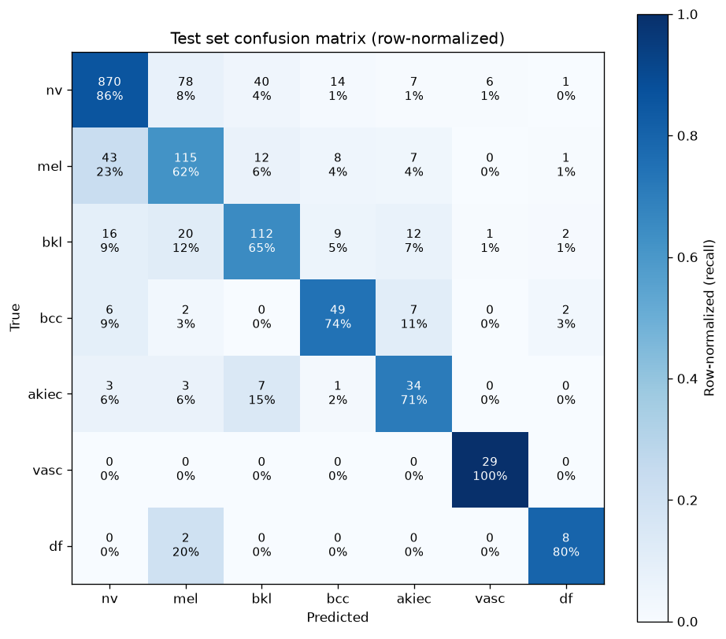

# HAM10000 Skin Lesion Classifier

> **⚠️ Not a medical device. Not for diagnostic use.**
> This project is an engineering demonstration of a reproducible ML pipeline on a public dermatoscopic benchmark. It is not validated for clinical use, has not been reviewed by a medical professional, and must not be used to make health decisions. Any suspected skin lesion should be evaluated by a qualified dermatologist.

A fine-tuned ResNet-50 classifier for seven-class diagnosis of pigmented skin lesions on the [HAM10000](https://doi.org/10.7910/DVN/DBW86T) dataset (~10,015 dermatoscopic images across 7 diagnostic categories). The project prioritizes engineering rigor over model novelty: honest data splitting, defensible metric choices, reproducible training, and a working inference API in a container.

The scientific question — *can a CNN learn to distinguish these lesion classes?* — is already answered by the dataset authors and the ISIC 2018 Challenge participants. This repo demonstrates the engineering wrapper around that answer: how you would actually ship such a model.

## Results

Evaluated on a held-out test set of **1,527 images** from HAM10000, split by `lesion_id` (no lesion appears in both train and test).

| Metric | Value |
|---|---|
| **Macro F1** | **0.7039** |
| **Balanced Accuracy** | **0.7681** |
| Top-1 accuracy | 0.7924 |

### Per-class performance

| Class | Recall | Precision | Support |
|---|---:|---:|---:|
| nv (nevus) | 0.86 | 0.93 | 1016 |
| mel (melanoma) | 0.62 | 0.52 | 186 |
| bkl (benign keratosis) | 0.65 | 0.66 | 172 |
| bcc (basal cell carcinoma) | 0.74 | 0.60 | 66 |
| akiec (actinic keratosis) | 0.71 | 0.51 | 48 |
| vasc (vascular lesion) | 1.00 | 0.81 | 29 |
| df (dermatofibroma) | 0.80 | 0.57 | 10 |



### Comparison to published baselines

The ISIC 2018 Challenge Task 3 used HAM10000 for the same seven-class task, scored by balanced multi-class accuracy (BACC). Two published reference points:

| Method | Test BACC | Notes |
|---|---:|---|
| WonDerM ensemble (2018) | 0.785 | 4-model ensemble, official challenge test set |
| LCA-EfficientNet-b2 (2021) | 0.853 | Search-based augmentation, single model |
| **This project** | **0.768** | Single ResNet-50, no ensemble, no TTA, lesion-grouped split |

The test sets are not identical (my evaluation uses a lesion-grouped split of the public HAM10000; the ISIC challenge used a separate held-out set only scored via the challenge server), so this comparison is directional rather than exact. However: **most published HAM10000 results do not group by `lesion_id`**, which inflates their reported scores because the same physical lesion often appears in both training and test data (see below). A strictly grouped baseline like this one should be compared with that caveat in mind.

## Why lesion-grouped splitting matters

HAM10000 contains **10,015 images but only 7,470 unique lesions.** Roughly 2,000 lesions were photographed multiple times — some as many as six times — often at slightly different angles, magnifications, or points in time.

If images are split randomly (or stratified only by class), the same physical lesion can appear in both the training set and the test set. The model then does not need to generalize — it can memorize the specific lesion during training and recognize it at test time. Reported test scores go up, but the model would perform worse on genuinely unseen patients.

This project splits by `lesion_id` using scikit-learn's `GroupShuffleSplit`, applied twice to produce a 70/15/15 train/val/test partition. Every lesion appears in exactly one split. The split logic includes a runtime assertion that raises if any `lesion_id` appears in more than one partition, so the guarantee is enforced by the code, not by convention.

The result: my reported metrics reflect performance on **completely new lesions**, not on new photographs of lesions the model has already seen. This is a stricter evaluation protocol than most published results on this dataset use, which is important context when reading the baseline comparison above.

The split manifests (`data/splits/train.csv`, `val.csv`, `test.csv`) are committed to this repository so the exact evaluation is reproducible — anyone with the raw HAM10000 data can recreate this exact experiment.

## Running the classifier

### Option 1 — Docker (recommended)

Everything is bundled in the container: model, dependencies, code. No Python installation required on your machine.

**Prerequisites:** [Docker](https://docs.docker.com/get-docker/) installed and running.
> **Note:** The Docker image bundles the trained model checkpoint (`checkpoints/best.pt`, ~270MB), which is not committed to this repository. Before building, either train the model yourself (see [Reproducing the training run](#reproducing-the-training-run)) or obtain the checkpoint separately. The build will fail with a `COPY` error if `checkpoints/best.pt` is missing.
```bash
# Clone
git clone https://github.com/amr10mubarak/ham10000-classifier.git
cd ham10000-classifier

# Build (~5 minutes on first build, ~30s on rebuilds thanks to layer caching)
docker build -t ham10000-classifier:0.1.0 .

# Run — API listens on port 8000
docker run --rm -p 8000:8000 ham10000-classifier:0.1.0
```

In another terminal:

```bash
# Health check
curl http://127.0.0.1:8000/health

# Classify an image — replace path with your own dermatoscopic image
curl -X POST http://127.0.0.1:8000/predict \
  -F "file=@path/to/your/image.jpg"
```

Interactive API docs: **http://127.0.0.1:8000/docs**

### Option 2 — Local Python

For development or if you want to retrain from scratch. Requires [`uv`](https://docs.astral.sh/uv/) (or use `pip` with `requirements.txt`).

```bash
git clone https://github.com/amr10mubarak/ham10000-classifier.git
cd ham10000-classifier
uv sync

# Serve the pretrained checkpoint (you'll need checkpoints/best.pt — see Reproducing training)
uv run uvicorn api.main:app --reload
```

### Example response

```json
{
  "predicted_class": "vasc",
  "confidence": 0.9999,
  "all_probabilities": {
    "nv": 2.9e-07,
    "mel": 8.0e-07,
    "bkl": 9.1e-09,
    "bcc": 2.0e-06,
    "akiec": 2.5e-11,
    "vasc": 0.9999,
    "df": 5.8e-10
  },
  "filename": "ISIC_0026092.jpg"
}
```

The API always returns probabilities for **all seven classes**, not just the top prediction, so downstream tools can implement their own confidence thresholds or flag low-certainty cases for human review.

## Reproducing the training run

The trained checkpoint (`checkpoints/best.pt`) is not committed to the repo (~270MB). To reproduce the exact model this project reports on:

1. **Get the data.** Download HAM10000 from Kaggle (`kmader/skin-cancer-mnist-ham10000`) into `data/raw/`. Requires a Kaggle account and API token.

```bash
    kaggle datasets download -d kmader/skin-cancer-mnist-ham10000 -p data/raw --unzip
```

2. **Regenerate the splits.** The split manifests are already committed (`data/splits/*.csv`), but if you want to reproduce them from scratch:

```bash
    uv run python -m src.splits
```

    Fixed seed (`42`) in `config.yaml` ensures the split is byte-identical to the one in this repo.

3. **Sanity-check the pipeline** before training:

```bash
    uv run python -m scripts.overfit_one_batch
```

    Loss should crash to near-zero within ~50 steps. If it doesn't, something in the pipeline is misconfigured (see `src/train.py`).

4. **Train.** GPU strongly recommended. On a Google Colab T4 (free tier), 20 epochs takes ~50 minutes:

```bash
    uv run python -m src.train
```

    All hyperparameters live in `config.yaml`. Best checkpoint (highest val macro F1) is saved to `checkpoints/best.pt`. Per-epoch metrics stream to `results/metrics.csv`.

5. **Evaluate on the held-out test set.** One and only one look at test — the results in this README come from this command:

```bash
    uv run python -m scripts.evaluate
```

## Limitations and what's next

**Small support on rare classes.** Only 10 `df` and 29 `vasc` images in the test set. Per-class recall on these classes is dominated by noise: one additional miss changes `df` recall by 10 percentage points. High reported recall on `vasc` (1.00) is real for this test split but shouldn't be interpreted as "solved."

**Overconfidence on wrong predictions.** The model frequently outputs high softmax probabilities (>0.65) for incorrect predictions. This is a known issue with cross-entropy-trained deep classifiers and means the raw confidence values are not directly interpretable as calibrated probabilities. Temperature scaling or a calibration study would be a natural next step before using this model's confidence in any triage workflow.

**Clinically dangerous failure mode.** ~23% of true melanomas in the test set are predicted as benign nevi. In a real diagnostic setting, this is the single most important metric to reduce — a false negative on melanoma is much more costly than a false positive on any other class. Addressing this would likely require class-conditional loss weighting beyond simple inverse frequency, a decision-threshold study, or a two-stage pipeline (binary "concerning vs not" followed by fine-grained classification).

**Concrete next steps if I were to extend this project:**

- **Learning rate scheduler** (e.g., cosine or step decay at epoch 10). Val loss oscillated in the second half of training; a decayed LR would likely stabilize convergence and squeeze a few F1 points.
- **Early stopping.** 20 epochs was too many; val F1 peaked at epoch 15. An early-stopping callback would save Colab time and formalize the "best-checkpoint" logic.
- **Model calibration.** A held-out calibration set + temperature scaling would let the reported confidences actually mean what they suggest.
- **Slimmer inference container.** The current image is ~2.5GB. Splitting training and inference dependencies (matplotlib, sklearn, timm's full utilities all only used for training/eval) would reduce this substantially.
- **Larger backbone.** A ResNet-101 or ConvNeXt-Tiny would probably improve raw metrics, at the cost of larger model size and slower inference.

None of these change the engineering story this project demonstrates — they refine metrics within an already-working pipeline.


## Project layout
<pre>
ham10000-classifier/
├── config.yaml # All hyperparameters, class list, paths
├── src/ # Training-time library code
│ ├── data.py # Dataset with construction-time validation
│ ├── splits.py # Lesion-grouped split with leakage assertion
│ ├── train.py # Full training loop (loss, optimizer, checkpointing)
│ └── transforms.py # Augmentation pipelines (train + eval)
├── scripts/ # Executable entry points
│ ├── check_batch.py # Data-pipeline smoke test
│ ├── overfit_one_batch.py # Training-pipeline sanity check
│ └── evaluate.py # Test-set evaluation with confusion matrix
├── api/ # Serving-time code (loaded in Docker)
│ ├── model.py # Checkpoint loading + single-image inference
│ └── main.py # FastAPI app
├── data/
│ ├── raw/ # HAM10000 images (gitignored, ~5GB)
│ └── splits/ # train.csv, val.csv, test.csv (committed)
├── checkpoints/ # Trained models (gitignored)
├── results/ # Metrics CSV, confusion matrix PNG
├── Dockerfile
├── requirements.txt # Pinned deps for Docker (derived from uv.lock)
└── pyproject.toml # uv-managed project deps'''</pre>


## Dataset citation

Tschandl, P. *The HAM10000 dataset, a large collection of multi-source dermatoscopic images of common pigmented skin lesions.* Sci. Data 5, 180161 (2018). doi:[10.1038/sdata.2018.161](https://doi.org/10.1038/sdata.2018.161)

## License

MIT (code). HAM10000 dataset has its own license — see the [original dataset page](https://doi.org/10.7910/DVN/DBW86T) for terms.